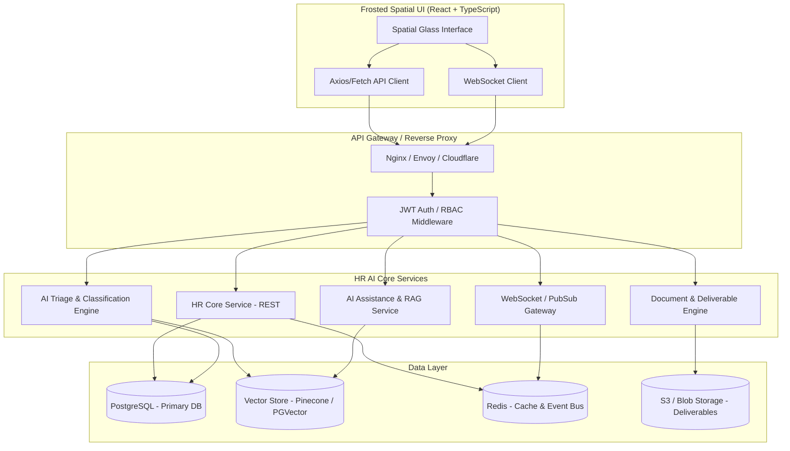

# HR AI Ecosystem - Complete Backend Integration & API Blueprint

This document specifies the full architectural design, API endpoints, WebSocket contracts, data models, and step-by-step instructions for connecting the **HR AI Service Desk Frontend** to a future production backend (e.g. Node.js / NestJS / FastAPI / Go).

---

## 1. High-Level System Architecture



---

## 2. Environment Configuration

The frontend comes preconfigured with dual-mode support (Mock Data for instant standalone preview, and Live API mode for production).

In `hr/frontend/.env`:
```env
# Set to 'false' when connecting to your live backend
VITE_USE_MOCK=false

# Base URL of your backend REST API
VITE_API_URL=http://localhost:8000/api/v1

# Base URL for live WebSocket telemetry
VITE_WS_URL=ws://localhost:8000/api/v1/ws

# Authentication Token Key in LocalStorage
VITE_AUTH_TOKEN_KEY=hr_auth_token
```

---

## 3. Authentication & Security Specifications

### Headers
Every authenticated request to the backend MUST include:
```http
Authorization: Bearer <jwt_access_token>
Content-Type: application/json
Accept: application/json
X-Client-Version: 3.4.0
```

### Role-Based Access Control (RBAC)
- `HR_ADMIN`: Full access to settings, triage rules, deliverables, HR actions, and telemetry.
- `HR_SPECIALIST`: Review cases, assist with drafts, execute routine HR approvals.
- `EMPLOYEE`: Self-service portal access (read own tickets, submit queries).

---

## 4. Complete REST API Endpoint Catalog

### 4.1 Authentication Endpoints

#### `POST /api/v1/auth/login`
Authenticates an HR specialist or administrator.
- **Request Body**:
```json
{
  "email": "sarah.jenkins@enterprise.internal",
  "password": "SecretPassword123!"
}
```
- **Response `200 OK`**:
```json
{
  "token": "eyJhbGciOiJIUzI1NiIsIn...",
  "refreshToken": "eyJhbGciOiJIUzI1NiIsIn...",
  "expiresIn": 3600,
  "user": {
    "id": "usr_9410",
    "name": "Sarah Jenkins",
    "email": "sarah.jenkins@enterprise.internal",
    "role": "HR_ADMIN",
    "title": "HR Operations Lead",
    "avatarUrl": "https://lh3.googleusercontent.com/aida/AEtjO1Xtd_6Zzb5Glq..."
  }
}
```

#### `GET /api/v1/auth/me`
Retrieves current session user profile.
- **Response `200 OK`**: User profile matching above schema.

---

### 4.2 Dashboard & Operational Telemetry

#### `GET /api/v1/dashboard/metrics`
Retrieves top bento card metrics and operational SLA stats.
- **Response `200 OK`**:
```json
{
  "openRequests": {
    "count": 128,
    "changePercent": 12.0,
    "comparisonText": "+12% this wk"
  },
  "highPriority": {
    "count": 17,
    "requiresAttention": 5
  },
  "pendingHRActions": {
    "count": 24,
    "waitingOver24h": 8
  },
  "slaCompliance": {
    "percent": 94.8,
    "changePercent": 2.1,
    "targetPercent": 92.0
  },
  "avgSla": "38m",
  "resolvedOvernight": 72,
  "nodeStatus": {
    "core": "OK",
    "sla": "99.8%",
    "triageAgent": "v3.4 Active"
  }
}
```

#### `GET /api/v1/dashboard/velocity?range=7D`
Provides time-series data for the glowing neon velocity chart.
- **Query Parameters**:
  - `range`: `7D` | `30D` | `90D` (default: `7D`)
- **Response `200 OK`**:
```json
{
  "range": "7D",
  "labels": ["Mon", "Tue", "Wed", "Thu", "Fri", "Sat", "Sun"],
  "incoming": [45, 52, 68, 80, 55, 92, 102],
  "resolved": [38, 44, 58, 70, 62, 78, 88],
  "openTotal": 128,
  "receivedToday": 86,
  "resolvedToday": 72
}
```

---

### 4.3 Requests & Case Management

#### `GET /api/v1/requests`
List, search, filter, and paginate HR tickets.
- **Query Parameters**:
  - `status`: `all` | `open` | `in_review` | `resolved` | `escalated`
  - `priority`: `all` | `high` | `medium` | `low`
  - `category`: `payroll` | `benefits` | `leave` | `documents` | `compliance` | `other`
  - `search`: string (e.g. `Alex`)
  - `page`: integer (default: `1`)
  - `limit`: integer (default: `20`)
- **Response `200 OK`**:
```json
{
  "total": 128,
  "page": 1,
  "limit": 20,
  "data": [
    {
      "id": "HR-1028",
      "title": "Payroll discrepancy in October bonus calculation",
      "employee": {
        "id": "EMP-410",
        "name": "Alex Johnson",
        "department": "Engineering",
        "email": "alex.j@enterprise.com",
        "avatar": "https://images.unsplash.com/photo-1535713875002-d1d0cf377fde?auto=format&fit=crop&w=120&q=80"
      },
      "category": "payroll",
      "priority": "high",
      "status": "in_review",
      "waitingTime": "3h 42m",
      "createdAt": "2026-10-24T06:15:00Z",
      "aiTriage": {
        "confidence": 0.98,
        "classification": "Payroll Tax & Bonus Delta",
        "autoRouted": true
      },
      "description": "Gross pay does not reflect the Q3 retention milestone agreed in appendix B."
    }
  ]
}
```

#### `POST /api/v1/requests`
Creates a new HR ticket manually or via command bar.
- **Request Body**:
```json
{
  "title": "Sabbatical policy clarification for Q1",
  "employeeId": "EMP-388",
  "category": "leave",
  "priority": "medium",
  "description": "Employee requesting 60-day unpaid sabbatical to participate in international fellowship."
}
```
- **Response `201 Created`**: Returns the newly created ticket object with generated `id`.

#### `POST /api/v1/requests/:id/review`
Executes an HR review decision, adds notes, or reassigns.
- **Request Body**:
```json
{
  "action": "resolve", // "resolve" | "request_info" | "escalate" | "reassign"
  "notes": "Reviewed bonus schedule with Finance. Adjusted difference will be remitted on Nov 1 cycle.",
  "assigneeId": "usr_9410"
}
```
- **Response `200 OK`**: Updated ticket object.

---

### 4.4 AI Triage Engine

#### `GET /api/v1/ai/triage/queue`
Retrieves live autonomous triage stream and telemetry metrics.
- **Response `200 OK`**:
```json
{
  "triagedToday": 86,
  "routingAccuracy": 99.1,
  "aiAssistedCases": 64,
  "draftsGenerated": 38,
  "queue": [
    {
      "id": "TR-881",
      "requestId": "HR-1028",
      "title": "Payroll discrepancy",
      "predictedCategory": "Payroll",
      "confidenceScore": 0.98,
      "urgencyScore": "HIGH",
      "reasoning": "Keywords detect withheld bonus and tax bracket delta matching Section 409A.",
      "suggestedAction": "Route to Senior Payroll Specialist & run Compensation Comparison Tool.",
      "status": "AUTO_ROUTED"
    }
  ]
}
```

#### `POST /api/v1/ai/triage/override`
Allows an HR specialist to correct an AI categorization for model re-tuning.
- **Request Body**:
```json
{
  "triageId": "TR-881",
  "correctedCategory": "Benefits",
  "overrideReason": "Relates to fringe benefit stipend rather than core base payroll."
}
```
- **Response `200 OK`**:
```json
{
  "status": "SUCCESS",
  "feedbackLogged": true
}
```

---

### 4.5 AI Assistance & Copilot (RAG)

#### `POST /api/v1/ai/assist/chat`
Ask the HR AI Copilot questions grounded in internal HR policies, employee handbooks, and compliance legislation.
- **Request Body**:
```json
{
  "prompt": "What is our company sabbatical leave eligibility requirement and maximum allowable duration?",
  "employeeContextId": "EMP-410"
}
```
- **Response `200 OK`**:
```json
{
  "reply": "According to Section 6.4 of the Enterprise Global Employee Handbook (Revised 2026), full-time employees with at least 3 years of continuous service are eligible for up to 90 consecutive calendar days of unpaid sabbatical leave. Health insurance coverage remains active with the standard employee premium share.",
  "citations": [
    {
      "title": "Enterprise Employee Handbook 2026",
      "section": "Section 6.4 - Sabbatical & Extended Leave",
      "page": 42
    }
  ],
  "suggestedActions": [
    "Generate Sabbatical Request Form",
    "Check Employee Tenure (Alex Johnson: 3.8 yrs - Eligible)"
  ]
}
```

#### `POST /api/v1/ai/assist/draft-letter`
Generates an AI-authored HR official document or response letter.
- **Request Body**:
```json
{
  "templateType": "VERIFICATION_OF_EMPLOYMENT", // or "OFFER_LETTER", "PAYROLL_RESOLUTION", "WARNING_LETTER"
  "recipientEmployeeId": "EMP-410",
  "customParameters": {
    "includeSalary": true,
    "purpose": "Mortgage Application"
  }
}
```
- **Response `200 OK`**:
```json
{
  "deliverableId": "DEL-302",
  "title": "Employment Verification - Alex Johnson",
  "generatedText": "To Whom It May Concern: This letter confirms that Alex Johnson is employed with Enterprise...",
  "status": "PENDING_HR_SIGN_OFF"
}
```

---

### 4.6 Deliverables & Documents

#### `GET /api/v1/deliverables`
Lists deliverables requiring HR review, sign-off, or dispatched to employees.
- **Response `200 OK`**:
```json
[
  {
    "id": "DEL-1024",
    "title": "October Retention Bonus Adjustment Letter",
    "type": "compensation_letter",
    "employeeName": "Alex Johnson",
    "status": "pending_approval",
    "generatedAt": "2026-10-24T08:30:00Z",
    "previewUrl": "/storage/deliverables/del_1024.pdf"
  }
]
```

#### `POST /api/v1/deliverables/:id/approve`
Approves and dispatches the document with cryptographic audit trail.
- **Response `200 OK`**: `{ "status": "APPROVED", "dispatchedAt": "2026-10-24T09:00:00Z" }`

---

### 4.7 HR Actions & Workflows

#### `GET /api/v1/actions`
Retrieves pending automated or 1-click HR operational actions (e.g. address updates, promotion payroll updates, equipment returns).

#### `POST /api/v1/actions/execute`
Executes an operational action workflow.
- **Request Body**:
```json
{
  "actionType": "APPROVE_SALARY_ADJUSTMENT",
  "targetEmployeeId": "EMP-410",
  "effectiveDate": "2026-11-01",
  "parameters": {
    "bonusDelta": 3500.00,
    "currency": "USD"
  }
}
```
- **Response `200 OK`**: `{ "status": "COMPLETED", "transactionId": "TX-99318" }`

---

### 4.8 Insights & Analytics

#### `GET /api/v1/insights/trends`
Provides process improvement bottlenecks (e.g. payroll up 23%, leave taking longer).
- **Response `200 OK`**:
```json
[
  {
    "id": "INS-1",
    "title": "Payroll requests ↑ 23%",
    "description": "Increase in payroll-related requests over the last 30 days due to tax deduction queries.",
    "severity": "info",
    "suggestedRemedy": "Publish 2026 Q4 Tax Withholding FAQ"
  },
  {
    "id": "INS-2",
    "title": "Leave requests taking longer",
    "description": "Resolution time is 31% above the HR average. Suggest updating self-service sabbatical guidelines.",
    "severity": "warning",
    "suggestedRemedy": "Activate Auto-Approve rule for leaves < 3 days"
  }
]
```

#### `GET /api/v1/insights/categories`
Provides categorical breakdown with volumes and percentages for distribution bars.
- **Response `200 OK`**:
```json
[
  { "name": "Payroll", "count": 42, "percent": 32, "color": "cyan" },
  { "name": "Benefits", "count": 28, "percent": 22, "color": "purple" },
  { "name": "Leave & Attendance", "count": 24, "percent": 19, "color": "emerald" },
  { "name": "Documents", "count": 18, "percent": 14, "color": "blue" },
  { "name": "Policy & Compliance", "count": 14, "percent": 11, "color": "amber" },
  { "name": "Other", "count": 8, "percent": 6, "color": "gray" }
]
```

---

## 5. Real-Time WebSocket Protocol

- **Connection URL**: `ws://<backend_host>/api/v1/ws?token=<jwt_token>`
- **Ping/Pong Heartbeat**: 30 seconds interval.

### Event Format
All WebSocket frames are JSON strings following this schema:
```json
{
  "event": "EVENT_NAME",
  "timestamp": "2026-10-24T12:00:00Z",
  "payload": {}
}
```

### Supported Events:
1. `triage.incoming`: Emitted when AI autonomously classifies a new incoming case.
2. `request.updated`: Emitted when another HR agent reviews or resolves a ticket.
3. `sla.warning`: Emitted when a case is within 15 minutes of SLA breach.
4. `telemetry.tick`: Emitted every 60s with updated SLA %, active nodes, and overnight resolved counter.

---

## 6. Database Reference Schema (PostgreSQL DDL)

```sql
CREATE TABLE users (
    id VARCHAR(36) PRIMARY KEY,
    name VARCHAR(255) NOT NULL,
    email VARCHAR(255) UNIQUE NOT NULL,
    password_hash VARCHAR(255) NOT NULL,
    role VARCHAR(50) DEFAULT 'HR_SPECIALIST',
    title VARCHAR(255),
    avatar_url TEXT,
    created_at TIMESTAMP WITH TIME ZONE DEFAULT CURRENT_TIMESTAMP
);

CREATE TABLE employees (
    id VARCHAR(36) PRIMARY KEY,
    first_name VARCHAR(100) NOT NULL,
    last_name VARCHAR(100) NOT NULL,
    email VARCHAR(255) UNIQUE NOT NULL,
    department VARCHAR(100),
    job_title VARCHAR(150),
    hire_date DATE,
    avatar_url TEXT
);

CREATE TABLE requests (
    id VARCHAR(36) PRIMARY KEY,
    title VARCHAR(255) NOT NULL,
    description TEXT,
    employee_id VARCHAR(36) REFERENCES employees(id),
    category VARCHAR(50) NOT NULL,
    priority VARCHAR(20) DEFAULT 'medium',
    status VARCHAR(30) DEFAULT 'open',
    ai_confidence NUMERIC(3, 2),
    ai_classification VARCHAR(100),
    waiting_minutes INT DEFAULT 0,
    assigned_to VARCHAR(36) REFERENCES users(id),
    created_at TIMESTAMP WITH TIME ZONE DEFAULT CURRENT_TIMESTAMP,
    resolved_at TIMESTAMP WITH TIME ZONE
);

CREATE TABLE deliverables (
    id VARCHAR(36) PRIMARY KEY,
    request_id VARCHAR(36) REFERENCES requests(id),
    title VARCHAR(255) NOT NULL,
    type VARCHAR(50) NOT NULL,
    content TEXT,
    status VARCHAR(30) DEFAULT 'pending_approval',
    file_path TEXT,
    created_at TIMESTAMP WITH TIME ZONE DEFAULT CURRENT_TIMESTAMP
);

CREATE TABLE audit_logs (
    id BIGSERIAL PRIMARY KEY,
    entity_type VARCHAR(50) NOT NULL,
    entity_id VARCHAR(36) NOT NULL,
    action VARCHAR(50) NOT NULL,
    actor_id VARCHAR(36) REFERENCES users(id),
    metadata JSONB,
    created_at TIMESTAMP WITH TIME ZONE DEFAULT CURRENT_TIMESTAMP
);
```

---

## 7. Connecting Frontend to Backend (Step-by-Step)

1. **Start your backend server** on `http://localhost:8000` (or your chosen port). Ensure it enables CORS for `http://localhost:5173`.
2. **Update frontend environment variable** in `hr/frontend/.env`:
   ```env
   VITE_USE_MOCK=false
   VITE_API_URL=http://localhost:8000/api/v1
   VITE_WS_URL=ws://localhost:8000/api/v1/ws
   ```
3. In `src/services/apiClient.ts`, all HTTP requests pass through the centralized Axios client with automatic Bearer token injection and error handling.
4. If the backend is temporarily unreachable, the frontend gracefully notifies the user with spatial toast alerts while preserving cached telemetry.
